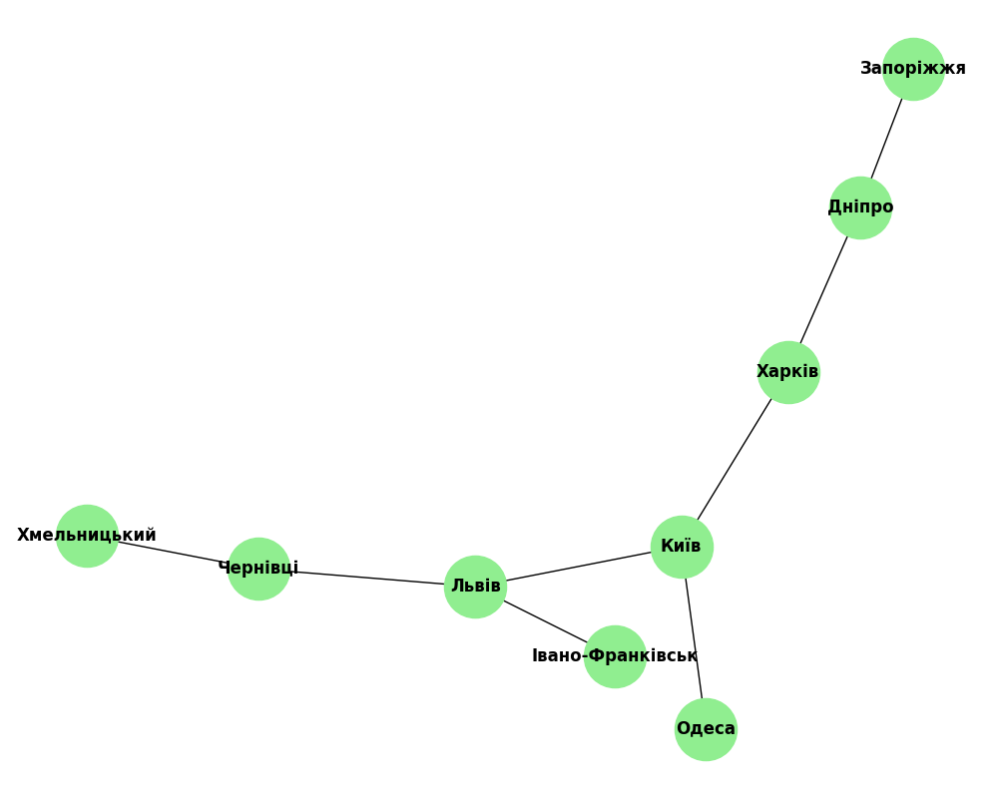

# goit-algo-hw-06

**Завдання 1. Граф для транспортної мережі:**

Кількість вершин (міст): 9
Кількість ребер (доріг): 8
Ступінь вершин:
Київ : 3
Харків : 2
Львів : 3
Одеса : 1
Дніпро : 2
Запоріжжя : 1
Івано-Франківськ : 1
Чернівці : 2
Хмельницький : 1

**Завдання 2. Алгоритми DFS і BFS для графа з мережею мміст:**

Шляхи з Києва до Чернівців за допомогою DFS:
['Київ', 'Львів', 'Чернівці']

Шляхи з Києва до Чернівців за допомогою BFS:
['Київ', 'Львів', 'Чернівці']

Обидва алгоритми, DFS і BFS, шукають шляхи з початкової вершини до кінцевої вершини, проте вони роблять це різними способами. DFS шукає шлях, що спускається глибше в граф, вибираючи перший знайдений шлях, тоді як BFS шукає шлях, який найкоротший за кількістю ребер. У випадку, коли існує безпосередній шлях між Києвом і Чернівцями через Львів, обидва алгоритми можуть знайти цей самий шлях.

**Завдання 3.  Алгоритм Дейкстри, пошук найкоротшого шляху:**

Найкоротший шлях з Києва до Харків: 500 км
Найкоротший шлях з Києва до Львів: 700 км
Найкоротший шлях з Києва до Одеса: 450 км
Найкоротший шлях з Києва до Дніпро: 800 км
Найкоротший шлях з Києва до Запоріжжя: 1000 км
Найкоротший шлях з Києва до Івано-Франківськ: 850 км
Найкоротший шлях з Києва до Чернівці: 950 км
Найкоротший шлях з Києва до Хмельницький: 1350 км
